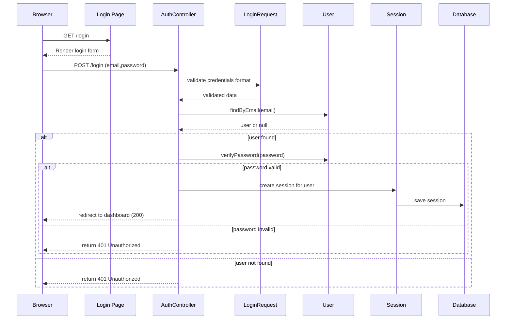

# Auth Login Sequence Diagram

```mermaid
sequenceDiagram
    participant Browser
    participant LoginPage as Login Page
    participant AuthController as AuthController
    participant LoginRequest as LoginRequest
    participant UserModel as User
    participant Session as Session
    participant Database

    Browser->>LoginPage: GET /login
    LoginPage-->>Browser: Render login form

    Browser->>AuthController: POST /login (email,password)
    AuthController->>LoginRequest: validate credentials format
    LoginRequest-->>AuthController: validated data
    AuthController->>UserModel: findByEmail(email)
    UserModel-->>AuthController: user or null
    alt user found
        AuthController->>UserModel: verifyPassword(password)
        alt password valid
            AuthController->>Session: create session for user
            Session->>Database: save session
            AuthController-->>Browser: redirect to dashboard (200)
        else password invalid
            AuthController-->>Browser: return 401 Unauthorized
        end
    else user not found
        AuthController-->>Browser: return 401 Unauthorized
    end
```
