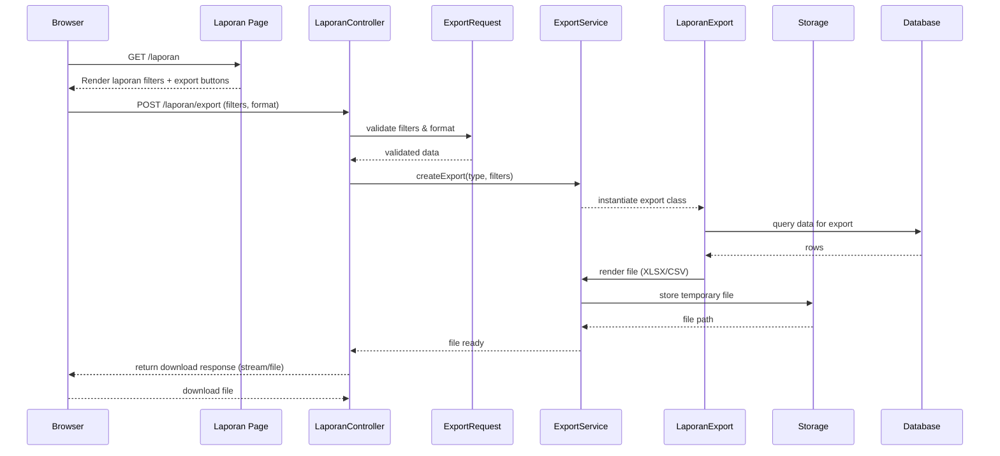

# Laporan Export Sequence Diagram

```mermaid
sequenceDiagram
    participant Browser
    participant ReportsPage as Laporan Page
    participant ReportsController as LaporanController
    participant Request as ExportRequest
    participant ExportService as ExportService
    participant LaporanExport as LaporanExport
    participant Storage
    participant Database

    Browser->>ReportsPage: GET /laporan
    ReportsPage-->>Browser: Render laporan filters + export buttons

    Browser->>ReportsController: POST /laporan/export (filters, format)
    ReportsController->>Request: validate filters & format
    Request-->>ReportsController: validated data
    ReportsController->>ExportService: createExport(type, filters)
    ExportService-->>LaporanExport: instantiate export class
    LaporanExport->>Database: query data for export
    Database-->>LaporanExport: rows
    LaporanExport->>ExportService: render file (XLSX/CSV)
    ExportService->>Storage: store temporary file
    Storage-->>ExportService: file path
    ExportService-->>ReportsController: file ready
    ReportsController-->>Browser: return download response (stream/file)
    Browser-->>ReportsController: download file
```
