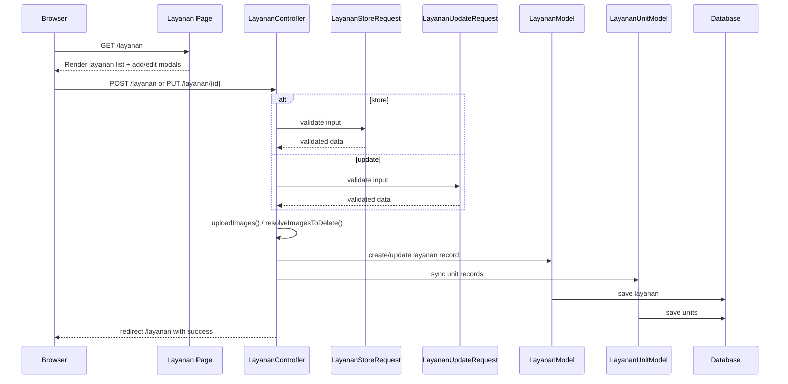

# Layanan Sequence Diagram

```mermaid
sequenceDiagram
    participant Browser
    participant LayananPage as Layanan Page
    participant Controller as LayananController
    participant StoreRequest as LayananStoreRequest
    participant UpdateRequest as LayananUpdateRequest
    participant LayananModel
    participant LayananUnitModel
    participant Database

    Browser->>LayananPage: GET /layanan
    LayananPage-->>Browser: Render layanan list + add/edit modals
    Browser->>Controller: POST /layanan or PUT /layanan/{id}
    alt store
        Controller->>StoreRequest: validate input
        StoreRequest-->>Controller: validated data
    else update
        Controller->>UpdateRequest: validate input
        UpdateRequest-->>Controller: validated data
    end
    Controller->>Controller: uploadImages() / resolveImagesToDelete()
    Controller->>LayananModel: create/update layanan record
    Controller->>LayananUnitModel: sync unit records
    LayananModel->>Database: save layanan
    LayananUnitModel->>Database: save units
    Controller-->>Browser: redirect /layanan with success
```
