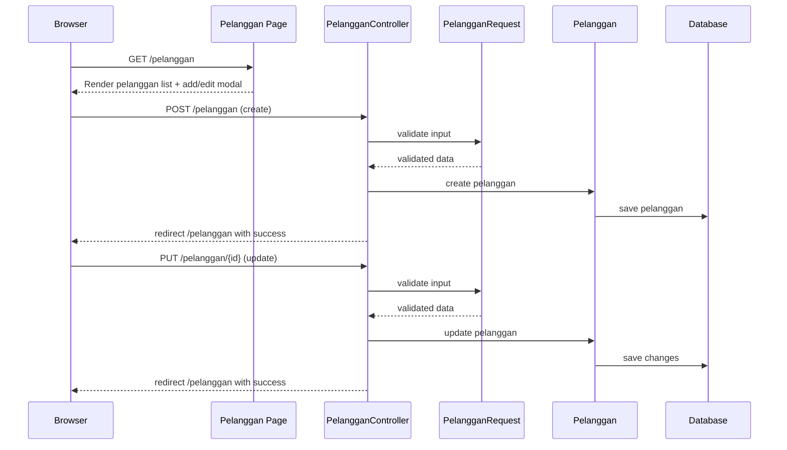

# Pelanggan Sequence Diagram

```mermaid
sequenceDiagram
    participant Browser
    participant PelangganPage as Pelanggan Page
    participant Controller as PelangganController
    participant Request as PelangganRequest
    participant PelangganModel as Pelanggan
    participant Database

    Browser->>PelangganPage: GET /pelanggan
    PelangganPage-->>Browser: Render pelanggan list + add/edit modal

    Browser->>Controller: POST /pelanggan (create)
    Controller->>Request: validate input
    Request-->>Controller: validated data
    Controller->>PelangganModel: create pelanggan
    PelangganModel->>Database: save pelanggan
    Controller-->>Browser: redirect /pelanggan with success

    Browser->>Controller: PUT /pelanggan/{id} (update)
    Controller->>Request: validate input
    Request-->>Controller: validated data
    Controller->>PelangganModel: update pelanggan
    PelangganModel->>Database: save changes
    Controller-->>Browser: redirect /pelanggan with success
```
