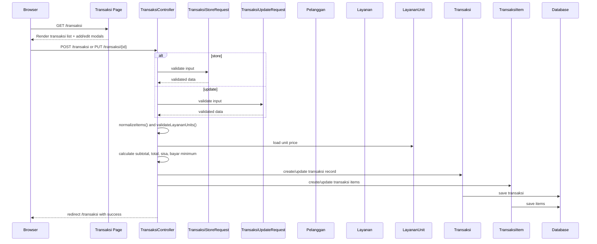

# Transaksi Sequence Diagram

```mermaid
sequenceDiagram
    participant Browser
    participant TransaksiPage as Transaksi Page
    participant Controller as TransaksiController
    participant StoreRequest as TransaksiStoreRequest
    participant UpdateRequest as TransaksiUpdateRequest
    participant PelangganModel as Pelanggan
    participant LayananModel as Layanan
    participant LayananUnitModel as LayananUnit
    participant TransaksiModel as Transaksi
    participant TransaksiItemModel as TransaksiItem
    participant Database

    Browser->>TransaksiPage: GET /transaksi
    TransaksiPage-->>Browser: Render transaksi list + add/edit modals
    Browser->>Controller: POST /transaksi or PUT /transaksi/{id}
    alt store
        Controller->>StoreRequest: validate input
        StoreRequest-->>Controller: validated data
    else update
        Controller->>UpdateRequest: validate input
        UpdateRequest-->>Controller: validated data
    end
    Controller->>Controller: normalizeItems() and validateLayananUnits()
    Controller->>LayananUnitModel: load unit price
    Controller->>Controller: calculate subtotal, total, sisa, bayar minimum
    Controller->>TransaksiModel: create/update transaksi record
    Controller->>TransaksiItemModel: create/update transaksi items
    TransaksiModel->>Database: save transaksi
    TransaksiItemModel->>Database: save items
    Controller-->>Browser: redirect /transaksi with success
```
